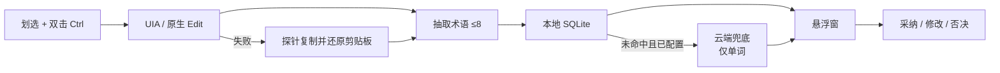

# Term Lens

**Windows 托盘划词注释器。** 不是终端透镜，也不做整篇翻译。

划选 AI 输出里的英文术语，双击 `Ctrl`，鼠标旁弹出行业通行中文注释。本地词库优先；你每次采纳、修改、否决都会沉淀成自己的决策日志。卡片顶部可用已查译法回填选区做**整句对照**（不是整句上云机翻）。

[](https://github.com/Dylan5237/term-lens/releases/latest)
[](https://github.com/Dylan5237/term-lens/actions/workflows/ci.yml)
[](LICENSE)
[](https://github.com/Dylan5237/term-lens/releases/latest)

<p align="center">
  
</p>

## 为什么不是翻译软件

| | 通用翻译 | Term Lens |
|---|---|---|
| 做什么 | 整句/整篇机翻 | 注释选区里的术语；对照行用已查译法回填原句 |
| 一词多义 | 猜一个译法 | 分不出域就平铺，标「当前语境」，不点选猜 |
| 网络 | 常常默认上云 | **默认零请求**；开启后只传术语单词 |
| 沉淀 | 用完即走 | 采纳写入个人层，可导出 CSV |

典型句子：

> 独立 **smoke** 的 **Runtime** 链路已走到预期受控失败

通用翻译器会整句改写。Term Lens 只告诉你：smoke → 冒烟测试，Runtime → 运行时。

## 快速开始

1. 从 [Releases](https://github.com/Dylan5237/term-lens/releases/latest) 下载 `TermLens_0.1.7_x64-setup.exe`（currentUser，免管理员）。
2. 安装后进程留在托盘。**默认不上云。**
3. 在普通桌面窗口划选文本，双击 `Ctrl`。

安装包**未做 Authenticode 签名**。首次运行若被 SmartScreen 拦截，选「仍要运行」。系统需 [WebView2](https://developer.microsoft.com/microsoft-edge/webview2/)（Win10/11 通常已有）。

不支持 Windows Terminal / ConPTY 取词。

## 功能

- **本地优先**：热路径走索引 SQLite，常用词目标 p95 &lt; 200ms。内置 AI/IT 种子词表。
- **选区一览**：抽出 ≥2 个术语时，未知在上、已知收起；点开一行在嵌套块里看释义并裁决。「当前语境」置顶。单术语仍是单卡。最多列出 8 个。
- **短语提取**：句子里空白相连的英文收成一条（≤4 词），中文或标点切断；不把 `JWT session 的 access token` 拆成隔字排列组合。
- **同译多层**：官方层和个人层译法相同时，一张卡并排打标，不标「多义」。
- **整句对照**：用已命中译法回填选区原文；未命中的词先留英文。不把整句送上云。
- **裁决闭环**：采纳 / 修改 / 否决。云端结果先落「待确认」，确认后才进词表。否决只伤个人层，不覆盖官方种子。
- **一词多义**：例如 `token` 在 LLM 语境锁定「词元」，安全语境保留「令牌」。平铺候选，绝不猜一个答案。
- **取词少碰剪贴板**：优先 UI Automation / 原生 Edit。Cursor 等读不到时才探针式 `Ctrl+C`，立刻还原；截图/文件剪贴板不走回退。读不到选区则中止：不查询、不上云、不写日志。
- **可选云端**：未命中才请求。只传术语单词。密钥走 Windows 凭据管理器（或 `TERM_LENS_API_KEY`），不要写进 `config.toml`。

## 使用

| 操作 | 说明 |
|---|---|
| 双击 `Ctrl` | 划选取词（托盘或配置可改为 `Alt+T`） |
| 点开列表一行 | ≥2 个术语时看该词释义并裁决 |
| 采纳 / 修改 / 否决 | 写入个人层 |
| 托盘左键 | 显示悬浮窗 |
| 托盘右键 | 词库统计/导出/导入、提示词、模型、位置与热键 |
| `Esc` / 点别处 | 隐藏悬浮窗 |

同一词再划一次仍会查询。悬浮窗随内容增高（最高 640px，且不超过工作区高度 2/3），贴边碰撞，下方不够则翻到指针上方。



## 配置云端（可选）

不配也能用，只有本地词表。`base_url` 为空则**零请求**。

1. 把 API Key 写入凭据管理器，目标名 `TermLens/api_key`；或设环境变量 `TERM_LENS_API_KEY`。
2. 编辑 `%APPDATA%\term-lens\config.toml`：

```toml
[provider]
base_url = "https://api.deepseek.com"   # OpenAI 兼容；不要用 /anthropic
model    = "deepseek-v4-flash"
timeout_ms = 3000
```

也允许：

- loopback：`http://127.0.0.1:10100/v1`
- 内网字面量 IP（RFC1918）：`http://192.168.0.10:13000/v1`

公网必须 **https**。公网 http、非法 URL 会直接失败且不发请求。loopback / 内网 IP 绕过系统代理。超时或不可达时静默只用本地结果，窗口标「离线」。

「恢复默认配置」与仓库 [`src-tauri/src/default_config.toml`](src-tauri/src/default_config.toml) 一致：`base_url = ""`。运行时提示词是 `%APPDATA%\term-lens\fallback_prompt.md`（内置副本：`src-tauri/src/fallback_prompt.md`）。

旧版 toml 里的 `api_key` 只有成功写入凭据并回读一致后才会从文件删除。

## 词库与命令行

内置种子：[`data/seed_terms.csv`](data/seed_terms.csv) + [`data/ai_terms_latest.csv`](data/ai_terms_latest.csv)。合并后 `(en, domain, layer)` 必须 unique。`data/llm_terms_raw.md` 只是 CSV 来源笔记，不是运行时词表。个人层只在本机；`--export` 导出活跃词，别人可用 `--rescan` 导入（不覆盖个人裁决；官方层被否决的条目可恢复）。

```powershell
$env:TERMLENS_CLI = "1"   # 可选；下列参数会自动跳过单实例互斥
term-lens.exe --export          # 导出 CSV
term-lens.exe --stats           # 命中率 / 真正 95 分位延迟
term-lens.exe --rescan xx.csv   # 导入外部词库
```

## 从源码构建

需要：Windows、[MSVC](https://visualstudio.microsoft.com/visual-cpp-build-tools/)（「使用 C++ 的桌面开发」）、Rust stable、Node（仅 Tauri CLI）、WebView2。

```powershell
npm install
npm test
npm run clippy
npm run build
```

绿色版：`src-tauri\target\release\term-lens.exe`  
安装包：`src-tauri\target\release\bundle\nsis\TermLens_0.1.7_x64-setup.exe`

开发：`npm run dev`。

## 明确不做

浏览器扩展、终端取词、整篇/整句上云机翻、云端流式跟翻、Linux/macOS、内存 LRU、微软 TBX、agents/Markdown 多格式导出。

设计依据：[DESIGN.md](DESIGN.md)。给代理的协作规范：[AGENTS.md](AGENTS.md)。变更见 [CHANGELOG.md](CHANGELOG.md)。

## License

[MIT](LICENSE)
